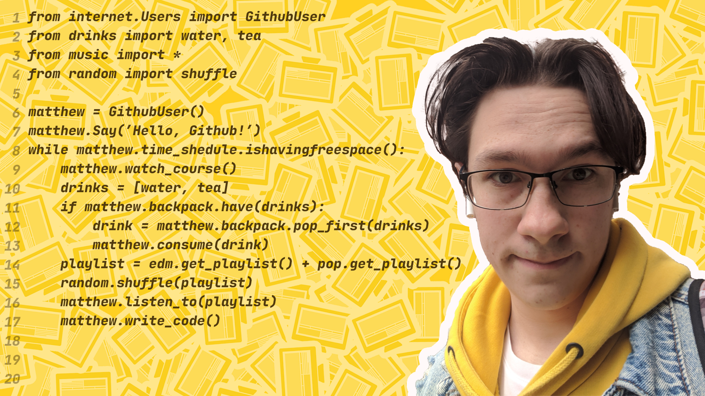

### Hi, I'm Matthew 👋...
and I'm a student 🎓 of Ural Federal University. My current location is Ekaterinburg, Russia 🇷🇺...
But you can easily find me on the internet, so... \

<details>
  <summary><b>Here is my socials!</b></summary>
  <a href="https://www.instagram.com/savmat2/"></a>
  <a href="mailto:savelevmatthew@gmail.com"></a>
  <a href="https://t.me/velevass"></a>
  <a href="https://discord.com/users/256709726564253707"></a>
</details>

<hr>

> - I'm currently moving forward with Data Science, with Python and math background
> - I'm looking for some internship next summer...

<hr>

#### Fun facts about me:
- Water 🌊 > tea 🍵 + coffee ☕
- self-education 🧑‍🎓 > hanging out > 0
- 🎹 🎸 in my 💖

<hr>

#### Tools I like and Use/Learn:
<details>
  <a href="https://www.python.org"></a>
  <a href="https://www.tensorflow.org"></a>
  <a href="https://numpy.org"></a>
  
  [](https://keras.io)
  [](https://www.djangoproject.com)
  [](https://www.qt.io)
  [](https://en.wikipedia.org/wiki/SQL)
  [](https://git-scm.com)
  [](https://www.apple.com/macos)
  [](https://www.microsoft.com/en-us/windows/)
  [](https://www.android.com)
  [](https://docs.microsoft.com/en-us/dotnet/csharp/)
  [](https://developer.mozilla.org/en-US/docs/Web/Guide/HTML/HTML5)
  [](https://developer.mozilla.org/en-US/docs/Learn/Getting_started_with_the_web/CSS_basics)
  [](https://developer.mozilla.org/en-US/docs/Web/JavaScript)
<br/><br/>
[](https://www.adobe.com)
[](https://pytorch.org)
[](https://pandas.pydata.org)
[](https://jupyter.org)
</details>

<hr>

<details>
  <summary>📊 Some account info 📊</summary>
  
  <br/>
  
</details>

<hr>

<!--START_SECTION:activity-->
<!--END_SECTION:activity-->
<!--START_SECTION:waka-->


**🐱 My GitHub Data** 

> 🏆 629 Contributions in the Year 2022
 > 
> 📦 217.8 kB Used in GitHub's Storage 
 > 
> 💼 Opted to Hire
 > 
> 📜 22 Public Repositories 
 > 
> 🔑 3 Private Repositories  
 > 
**I'm an Early 🐤** 

```text
🌞 Morning    5 commits      ░░░░░░░░░░░░░░░░░░░░░░░░░   1.49% 
🌆 Daytime    226 commits    ████████████████░░░░░░░░░   67.46% 
🌃 Evening    89 commits     ██████░░░░░░░░░░░░░░░░░░░   26.57% 
🌙 Night      15 commits     █░░░░░░░░░░░░░░░░░░░░░░░░   4.48%

```
📅 **I'm Most Productive on Friday** 

```text
Monday       23 commits     █░░░░░░░░░░░░░░░░░░░░░░░░   6.87% 
Tuesday      30 commits     ██░░░░░░░░░░░░░░░░░░░░░░░   8.96% 
Wednesday    43 commits     ███░░░░░░░░░░░░░░░░░░░░░░   12.84% 
Thursday     38 commits     ██░░░░░░░░░░░░░░░░░░░░░░░   11.34% 
Friday       174 commits    █████████████░░░░░░░░░░░░   51.94% 
Saturday     10 commits     ░░░░░░░░░░░░░░░░░░░░░░░░░   2.99% 
Sunday       17 commits     █░░░░░░░░░░░░░░░░░░░░░░░░   5.07%

```


📊 **This Week I Spent My Time On** 

```text
⌚︎ Time Zone: Asia/Yekaterinburg

💻 Operating System: 
No Activity Tracked This Week

```


 Last Updated on 17/06/2022 18:51:56 UTC
<!--END_SECTION:waka-->
